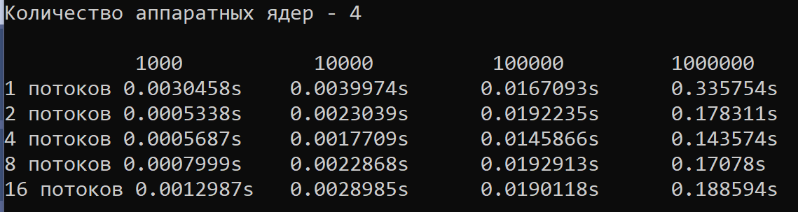

## Домашнее задание к занятию «Многопоточность»

### Задание 1

#### Очередь клиентов

Вам нужно создать приложение, которое имитирует очередь в окошко. Для этого нужно создать два потока, работающие с одной разделяемой переменной.

Первый поток имитирует клиента: раз в секунду он обращается к счётчику клиентов и увеличивает его на 1. Максимальное количество клиентов должно быть параметризировано.

Второй поток имитирует операциониста: раз в 2 секунды он обращается к счётчику клиентов и уменьшает его на 1. «Операционист» работает до последнего клиента.

### Задание 2

#### Параллельные вычисления

- Напишите программу для расчёта суммы двух векторов.
- Распараллельте эту программу на 2, 4, 8 и 16 потоков.
- Определите, какое количество потоков даёт самый быстрый результат.
- Сравните результаты выполнения для массивов из 1 000, 10 000, 100 000 и 1 000 000 элементов.
- Время выполнения для каждого варианта сведите в таблицу и выведите её в консоль.
- Первый запущенный поток должен вывести на экран доступное количество аппаратных ядер.

___________________________________________________________________________________________________

## Домашнее задание к занятию «Конкуренция, состояние гонки»

### Задание 1

#### Атомарная очередь клиентов

Нужно модифицировать [задание 1 к первому уроку](https://github.com/netology-code/map-homeworks/tree/main/01) так, чтобы счётчик клиентов был атомарным. 
Все операции со счётчиков должны быть атомарными. 
Проверьте работу различными способами упорядочения доступа к памяти.

### Задание 2

#### Прогресс-бар

Создайте консольное приложение для имитации многопоточного расчёта. 
Количество потоков, длина расчёта должны быть заданы переменными. 
В консоль во время работы программы должны построчно для каждого потока выводиться:

	• номер потока по порядку;
	
	• идентификатор потока;
	
	• заполняющийся индикатор наподобие прогресс-бара, визуализирующий процесс «расчёта»;
	
	• после завершения работы каждого потока в соответствующей строке суммарное время, затраченное на работу потока.
 
 Строки прогресс-баров каждого потока должны выводиться одновремено. Время появления каждого нового символа в строке прогресс-бара подберите так, чтобы процесс заполнения строки был виден. Пример работы программы [по ссылке.]( https://cloud.mail.ru/public/MZVL/AqpmAkcMp)

#### Дополнение к заданию 2*

Во время очередной итерации «расчёта» сымитируйте со случайной вероятностью возникновение ошибки (exception), которая не должна приводить к прекращению работы потока или программы. При этом этот факт должен визуализироваться отдельным цветом на прогресс-баре.

### Задание 3

#### Защищённый обмен данными

- Создайте класс Data, содержащий в качестве полей скалярные данные и мьютекс.
- Создайте функцию swap, которая принимает ссылки на два объекта класса Data и обменивает их местами. 
- В функциях нужно сначала захватить мьютексы обоих объектов, а затем выполнить обмен данными.
- Реализуйте три варианта этой функции: при помощи lock, scoped_lock и unique_lock.
  

___________________________________________________________________________________________________
## Домашнее задание к занятию «Асинхронное программирование»

### Задание 1
#### Сортировка выбором

Реализуйте алгоритм сортировки выбором.
Сортировка выбором состоит в том, что в неупорядоченном списке находится наименьший элемент. Выбранный в исходном списке минимальный элемент записывается на i-е место исходного списка (i=1,2,…,п), а элемент с i-го места — на место выбранного. При этом очевидно, что уже упорядоченные элементы, а они будут расположены, начиная с первого места, исключаются из дальнейшей сортировки, поэтому длина списка, участвующего в каждом последующем просмотре, должна быть на один элемент меньше предыдущего.
Поиск минимального элемента реализуйте в виде асинхронной задачи.
Результат должен возвращаться в основной поток через связку std::promise-std::future.

 
### Задание 2
#### Реализуйте параллельный вариант оператора for_each.

Функция должна принимать итераторы на начало и конец контейнера и ссылку, обрабатывающую функцию.
При реализации нужно рекурсивно разделить контейнер на несколько блоков и для каждого запустить отдельную задачу, применяющую обрабатывающую функцию к части контейнера.

___________________________________________________________________________________________________
## Домашнее задание к занятию «Рефакторинг»

### Задание 1
#### Геометрические фигуры

Представлен класс, описывающий геометрические фигуры:

* линия,
* прямоугольник,
* параллелепипед,
* окружность,
* цилиндр.

Класс, описывающий геометрические преобразования фигур:

* смещения по осям x, y, z;
* масштабирование по отдельным осям;
* полное масштабирование.

Нужно выделить из кода «плохие запахи» и провести рефакторинг кода, приведя его к корректному виду.

 

___________________________________________________________________________________________________
## Курсовой проект «Потокобезопасная очередь»

Пул потоков на базе потокобезопасной очереди.

### Что нужно сделать:

1. Создать потокобезопасную очередь, хранящую функции, предназначенные для исполнения.
2. На основе этой очереди реализовать пул потоков. 
3. Этот пул состоит из фиксированного числа рабочих потоков, равного количеству аппаратных ядер.
4. Когда у программы появляется какая-то работа, она вызывает функцию, которая помещает эту работу в очередь.
5. Рабочий поток забирает работу из очереди, выполняет указанную в ней задачу, после чего проверяет, есть ли в очереди другие работы.

### Реализуемые классы

#### 1. Класс thread_pool — реализация пула потоков.

Минимально требуемые поля класса thread_pool:

* вектор потоков, которые инициализируют в конструкторе класса и уничтожают в деструкторе;
* потокобезопасная очередь задач для хранения очереди работ;
* остальные поля на усмотрение разработчика.

Минимально требуемые методы класса thread_pool:

* метод work — выбирает из очереди очередную задачу и исполняет её. Этот метод передаётся конструктору потоков для исполнения;
* метод submit — помещает в очередь задачу. В качестве аргумента метод может принимать или объект шаблона std::function, или объект шаблона package_task;
* остальные методы на усмотрение разработчика.

#### 2. Шаблонный класс safe_queue — реализация очереди, безопасной относительно одновременного доступа из нескольких потоков.

Минимально требуемые поля класса safe_queue:

* очередь std::queue для хранения задач,
* std::mutex для реализации блокировки,
* std::condtional_variables для уведомлений.

Минимально требуемые методы класса safe_queue:

* метод push — записывает в начало очереди новую задачу. При этом захватывает мьютекс, а после окончания операции нотифицируется условная переменная;
* метод pop — находится в ожидании, пока не придёт уведомление на условную переменную. При нотификации условной переменной данные считываются из очереди;
* остальные методы на усмотрение разработчика.

### Алгоритм работы

1. Объявить объект класса thread_pool.
2. Описать несколько тестовых функций, выводящих в консоль своё имя.
3. Раз в секунду класть в пул одновременно 2 функции и проверять их исполнение.

# 

